```mermaid
flowchart LR
    %% =========================
    %% User / Client
    %% =========================
    User["👤 User<br/>(curl / UI)"]

    %% =========================
    %% Spring Boot App (Student)
    %% =========================
    subgraph SB["🔨 Spring Boot Application<br/>lab_mcp_ai_agent_springboot"]
        AgentController["🔨 AgentController<br/>REST API<br/>POST /api/run"]

        AgentService["🔨 AgentService<br/>Orchestrates Agent"]

        BacklogAgent["🔨 BacklogAgent<br/>(LangChain4j AI Service)<br/>System + User Prompt"]

        LangChainConfig["🔨 LangChainConfig<br/>GoogleChatModel<br/>Tool Wiring"]

        GitHubMcpTools["🔨 GitHubMcpTools<br/>@Tool createIssue(...)"]

        McpHttpClient["🔨 McpHttpClient<br/>JSON-RPC over HTTP"]
    end

    %% =========================
    %% External AI
    %% =========================
    Gemini["📦 Google Gemini API<br/>(chat + tool-use)"]

    %% =========================
    %% MCP Layer
    %% =========================
    subgraph MCP["📦 MCP Layer"]
        MCPWrapper["🔨 MCP HTTP Wrapper<br/>(Node.js / Express)<br/>POST /mcp"]
        GitHubMCP["📦 GitHub MCP Server<br/>(STDIO, official)"]
    end

    %% =========================
    %% GitHub
    %% =========================
    GitHub["📦 GitHub API<br/>(Issues, Repos)"]

    %% =========================
    %% Flows
    %% =========================
    User -->|HTTP POST /api/run| AgentController
    AgentController --> AgentService
    AgentService --> BacklogAgent

    BacklogAgent -->|chat + tool schema| Gemini
    Gemini -->|tool call request| BacklogAgent

    BacklogAgent -->|Java @Tool call| GitHubMcpTools
    GitHubMcpTools --> McpHttpClient

    McpHttpClient -->|JSON-RPC HTTP| MCPWrapper
    MCPWrapper -->|STDIO| GitHubMCP
    GitHubMCP -->|REST| GitHub

    GitHub --> GitHubMCP
    GitHubMCP --> MCPWrapper
    MCPWrapper --> McpHttpClient
    McpHttpClient --> GitHubMcpTools
    GitHubMcpTools --> BacklogAgent
    BacklogAgent --> AgentService
    AgentService --> AgentController
```

# 🧪 LAB – Building an MCP AI Agent with Gemini
**Java · Spring Boot · Gradle · LangChain4j · MCP · Gemini · Testing · CI/CD · Docker · GitHub**

---
In this lab, you will build a real AI agent not a chatbot.
The agent will understand user intent and take real actions on GitHub using MCP.


**This project implements an AI Agent.**
An AI Agent is a system that:
•	understands user intent,
•	reasons about what needs to be done,
•	and takes actions on external systems through controlled tools.
---

## 🎯 Global Lab Objective

Build **step by step** an **AI agent** able to:

1. understand a natural language request,
2. reason with **Gemini (Google)**,
3. calls **standardized tools via MCP**,
4. automatically create a **GitHub issue**,
5. be **tested**, **containerized**, and **integrated into CI/CD**.

---

## 🧠 End-to-end Use Case

> “Create a task to add OpenTelemetry and export traces via OTLP”

⟶ a **well-structured GitHub issue** is created automatically.

---

## 🏗️ Target Architecture

```text
User
  ↓  HTTP POST /api/run
AgentController (Spring Boot)
  ↓
AgentService
  ↓
LangChain4j Agent (BacklogAgent)
  ↓  tool call (@Tool)
GitHubMcpTools (Spring Boot)
  ↓
McpHttpClient
  ↓  JSON-RPC over HTTP
MCP HTTP Wrapper (Node.js)
  ↓  STDIO
GitHub MCP Server (official)
  ↓
GitHub API (Issues)
```



---

# 🧭 Mandatory Rule – Issue‑Driven Development (GitHub)

> ⚠️ **This lab MUST be executed in an issue‑driven manner.**  
> **No code is allowed without a GitHub ticket.**

All steps in this lab must follow **professional agile practices**, exactly as in a real engineering team.

---

## 🧠 Core Principle

- **1 STEP = 1 GitHub Issue**
- **All steps belong to a single Feature / Epic**
- Each issue must be:
  - created before coding
  - implemented on a dedicated branch
  - linked to commits
  - closed via a Pull Request

---

## 🧩 GitHub Structure to Use

### 1️⃣ Feature / Epic (created once)

Create a GitHub Issue:

**Title**
```
[FEATURE] AI Agent – LangChain4j + MCP + Gemini
```

**Description**
```md
-## Goal
Build an AI agent using LangChain4j 1.10.0 that:
- reasons with Gemini (Google)
- calls tools via MCP
- creates GitHub issues automatically

-## Scope
- Spring Boot
- LangChain4j 1.10.0
- MCP (HTTP / JSON‑RPC)
- Docker
- CI/CD

-## Tasks
All implementation steps are tracked as child issues.
```

👉 This issue stays **OPEN until the end of the lab**.

---

### 2️⃣ One GitHub Issue per STEP

Each step in this lab **must have its own issue**.

**Naming convention**
```
[STEP X] <short description>
```

---

## 🔗 STEP ↔ GitHub Issue Mapping

| Lab Step | GitHub Issue Title                                  |
|----------|-----------------------------------------------------|
| STEP 1   | `[STEP 1] Bootstrap project with Spring Initializr` |
| STEP 1.1 | `[STEP 1.1] Create sample User`                     |
| STEP 2   | `[STEP 2] Add LangChain4j 1.10.0 dependencies`      |
| STEP 3   | `[STEP 3] Configure Google and MCP endpoints`    |
| STEP 4   | `[STEP 4] Connect LangChain4j to Gemini`            |
| STEP 5   | `[STEP 5] Implement MCP HTTP client`                |
| STEP 6   | `[STEP 6] Bridge MCP tools with LangChain4j`        |
| STEP 7   | `[STEP 7] Expose Agent REST API`                    |
| STEP 8   | `[STEP 8] Add unit tests for MCP bridge`            |
| STEP 9   | `[STEP 9] Add integration tests`                    |
| STEP 10  | `[STEP 10] Dockerize the agent`                     |
| STEP 11  | `[STEP 11] Setup CI/CD with GitHub Actions`         |

---

## 📄 Standard Issue Template (MANDATORY)

Each STEP issue **must follow this template**:

```md
-## Context
Why this step is required.

-## Goal
What must be implemented.

-## Acceptance Criteria
- [ ] Code implemented
- [ ] Tests added (if applicable)
- [ ] Build passes
- [ ] CI is green

-## Out of Scope
Explicitly excluded items.

-## References
- Lab STEP X
```

---

## 🌱 Branch & Commit Rules

For each issue:

```bash
git checkout -b step-X-short-description
```

Commits **must reference the issue number**:

```bash
git commit -m "feat(step-X): <short description> (#ISSUE_ID)"
```

---

## 🔁 Pull Request Rules

- One PR per STEP
- PR description must reference the issue
- Issue is closed **only when PR is merged**

---

## 🏷️ Required GitHub Labels

Create the following labels in the repository:

- `feature`
- `bug`
- `test`
- `docker`
- `ci-cd`

---

## 🧠 Bonus (Advanced / Recommended)

From **STEP 7 onward**, students are encouraged to use the **agent itself** to manage the backlog:

> “Create a GitHub task for adding Docker support”

The agent should:
- create the GitHub issue
- which is then implemented by the students

🔥 This creates a **self‑referential agent → backlog → code loop**.

---

## ✅ Evaluation Criteria (Suggested)

- ✔️ One STEP = one closed issue
- ✔️ Commits linked to issues
- ✔️ Clean PR history
- ✔️ CI green
- ✔️ Feature / Epic closed at the end

---

# 🔹 STEP 0 — Prerequisites

- Java 21
- Git
- GitHub account + repository
- Google API key
- Fine‑grained GitHub token (Issues RW)

Export secrets:

```bash
export GOOGLE_API_KEY=YOUR_GOOGLE_API_KEY
export GITHUB_TOKEN=github_pat_xxx
export GITHUB_OWNER="whoIam"
export GITHUB_REPO="lab_mcp_ai_agent_springboot"
```

---

## 🔹 STEP 0.1 — Run the GitHub MCP HTTP Wrapper (Local Development)

In this step, students will run **both**:
- the **official GitHub MCP Server (STDIO)** locally via Docker
- the **GitHub MCP HTTP Wrapper** provided in the repository

The wrapper exposes the STDIO-based MCP server over **HTTP**, making it usable
by the Spring Boot application and later deployable to Docker / Minikube.

> 📁 The wrapper source code is provided under:
> `./mcp-github-http-wrapper`

---

### 0.1.1 Prerequisites

Ensure the following are installed on your development machine:

- **Node.js ≥ 20**
- **npm**
- **Docker**

Verify:
```bash
node -v
npm -v
docker version
```

---

### 0.1.2 Configure GitHub Authentication

Create a GitHub Personal Access Token (PAT):
- in GitHub/Settings/Developer settings/Personal access tokens/Fine-grained tokens

- Prefer a **Fine-grained token**
- Grant:
  - **Issues: Read and write**
  - Access to the target repository

Export the token:

```bash
export GITHUB_PERSONAL_ACCESS_TOKEN=ghp_xxxxxxxxxxxxxxxxx
```

---

### 0.1.3 Run the Official GitHub MCP Server (STDIO)

The GitHub MCP server runs in **STDIO mode** and is required by the HTTP wrapper.

Run it in a dedicated terminal:

```bash
docker run --rm -i   -e GITHUB_PERSONAL_ACCESS_TOKEN=$GITHUB_PERSONAL_ACCESS_TOKEN   ghcr.io/github/github-mcp-server
```

Expected behavior:
- The container starts and waits for STDIO input
- No HTTP port is exposed
- This process must remain running

⚠️ **Important**  
Do not stop this container while working on the lab.

---

### 0.1.4 Install Dependencies for the HTTP Wrapper

copy/clone https://github.com/pierre-filliolaud/lab_mcp_ai_agent_springboot

From the project root:
```bash
cd mcp-github-http-wrapper
npm install
```

This installs:
- Express
- Model Context Protocol SDK
- Required runtime dependencies

---

### 0.1.5 Start the MCP HTTP Wrapper

In a **second terminal**, start the wrapper:

```bash
npm start
```

Expected output:
```text
GitHub MCP HTTP Wrapper listening on http://localhost:3333/mcp
```

Internally, the wrapper:
- Connects to the running GitHub MCP server via **STDIO**
- Exposes MCP tools over **HTTP JSON-RPC**

---

### 0.1.6 Verify MCP Tools Are Available

In a **third terminal**, test the MCP endpoint:

```bash
curl http://localhost:3333/mcp \
  -H "Content-Type: application/json" \
  -d '{
    "jsonrpc": "2.0",
    "id": "1",
    "method": "tools/list",
    "params": {}
  }'
```

You should receive a response containing GitHub tools, for example:

```json
{
  "result": {
    "tools": [
      {
        "name": "create_issue",
        "description": "Create a GitHub issue"
      }
    ]
  }
}
```

⚠️ **Note:**  
The exact tool name (e.g. `create_issue`) must be used later
in the Spring Boot MCP client.

---

### 0.1.7 Architecture Reminder

At this stage, the local architecture is:

```text
Spring Boot App (not started yet)
  ↓ JSON-RPC (HTTP)
GitHub MCP HTTP Wrapper (Node.js)
  ↓ STDIO
GitHub MCP Server (Docker)
  ↓
GitHub API
```

---

# 🔹 STEP 1 — Project Bootstrap with Spring Initializr

### 🎯 Objective
Generate a clean and standard **Spring Boot project skeleton** using **Spring Initializr**.

---

## 1.1 Use Spring Initializr (Web UI)

Go to 👉 https://start.spring.io

Select the following options:

- **Project**: Gradle – Groovy
- **Language**: Java
- **Spring Boot**: 3.3.x (or latest 3.x)
- **Group**: `com.example`
- **Artifact**: `agent`
- **Name**: `agent`
- **Packaging**: Jar
- **Java**: 21

### Dependencies to add:
- Spring Web
- Spring Validation

👉 Click **Generate**, unzip the project.

---

## 1.2 Alternative: Spring Initializr via CLI

If you prefer the command line:

```bash
curl https://start.spring.io/starter.zip \
  -d project=gradle \
  -d language=java \
  -d bootVersion=3.3.5 \
  -d javaVersion=21 \
  -d groupId=com.example \
  -d artifactId=mcp-agent \
  -d name=mcp-agent \
  -d dependencies=web,validation \
  -o mcp-agent.zip
```

```bash
unzip agent.zip
cd agent
```

---

## 1.3 Verify the Generated Project

Run:

```bash
./gradlew clean test
./gradlew bootRun
```

Open your browser:

👉 http://localhost:8080

You should see a **404 page** (expected, no controller yet).

✅ Spring Boot is running correctly.

---

# Target Recommended Package Layout
```text
com.example.agent
├── Application.java
├── config/
│   ├── LangChainConfig.java
│   ├── WebClientConfig.java
│   └── PropertiesConfig.java           (optional)
├── domain/
│   └── User.java
├── web/
│   ├── AgentController.java
│   ├── UserController.java
│   ├── DebugController.java            (optional)
│   ├── dto/
│   └── └── UserDTO.java
├── service/
│   ├── UserService.java
│   ├── AgentService.java
│   ├── dto/
│   └── └── UserDTO.java
├── agent/
│   ├── BacklogAgent.java               (LangChain4j AI Service interface)
│   └── prompts/                        (optional: prompt constants)
│       └── BacklogPrompts.java
├── tools/
│   ├── AgentTool.java                  (marker interface)
│   └── github/
│       └── GitHubMcpTools.java
├── mcp/
│   ├── McpHttpClient.java
│   ├── McpToolNames.java               (constants for MCP tool names)
│   └── dto/                            (optional, if you type JSON-RPC payloads)
│       ├── JsonRpcRequest.java
│       └── JsonRpcResponse.java
├── domain/                             (optional)
│   └── IssueDraft.java                 (title / body / metadata)
└── util/                               (optional)
    └── JsonUtils.java
```

---

# 🔹 STEP 1.4 — Setup CI/CD (Build & Test)

> 🚨 **CI is mandatory immediately after STEP 1**

**Issue**
```
[STEP 1.5] Setup CI to build and test the project
```

Create file:

`.github/workflows/ci.yml`

```yaml
name: CI

on:
  push:
    branches: [ "**" ]
  pull_request:
    branches: [ "main" ]

jobs:
  build-test:
    runs-on: ubuntu-latest
    steps:
      - uses: actions/checkout@v4

      - name: Setup JDK 21
        uses: actions/setup-java@v4
        with:
          distribution: temurin
          java-version: "21"
          cache: gradle

      - name: Grant execute permission
        run: chmod +x gradlew

      - name: Build & Test
        run: ./gradlew --no-daemon clean test
```

Validation:
- GitHub Actions → **green build**
- No secrets required at this stage

(Optional) Add CI badge to `README.md`.

---

# 🔹 STEP 1.5 — Add a Simple “User” Vertical Slice (Domain + Service + Web)

### 🎯 Objective
Before adding AI/MCP complexity, implement a minimal, clean **vertical slice** to validate:

- package structure (`domain`, `service`, `web`)
- Spring dependency injection
- REST endpoint behavior
- basic testing approach

This step produces a working example:

```text
UserController (web)
  ↓
UserService (service)
  ↓
User (domain)
```

---

## 1.5.1 Create the Domain Model

Create file: `src/main/java/com/example/agent/domain/User.java`

```java
package com.example.agent.domain;

public record User(String id, String name, String email) { }
```

---

## 1.5.2 Create the Service

Create file: `src/main/java/com/example/agent/service/UserService.java`

```java
package com.example.agent.service;

import com.example.agent.domain.User;
import org.springframework.stereotype.Service;

import java.util.Map;
import java.util.UUID;
import java.util.concurrent.ConcurrentHashMap;

@Service
public class UserService {

    private final Map<String, User> store = new ConcurrentHashMap<>();

    public User create(String name, String email) {
        String id = UUID.randomUUID().toString();
        User user = new User(id, name, email);
        store.put(id, user);
        return user;
    }

    public User getById(String id) {
        User user = store.get(id);
        if (user == null) {
            throw new IllegalArgumentException("User not found: " + id);
        }
        return user;
    }
}
```

---

## 1.5.3 Create the Web Controller

Create file: `src/main/java/com/example/agent/web/UserController.java`

```java
package com.example.agent.web;

import com.example.agent.domain.User;
import com.example.agent.service.UserService;
import org.springframework.http.MediaType;
import org.springframework.web.bind.annotation.*;

@RestController
@RequestMapping("/api/users")
public class UserController {

    private final UserService users;

    public UserController(UserService users) {
        this.users = users;
    }

    @PostMapping(produces = MediaType.APPLICATION_JSON_VALUE)
    public User create(@RequestParam String name, @RequestParam String email) {
        return users.create(name, email);
    }

    @GetMapping(value = "/{id}", produces = MediaType.APPLICATION_JSON_VALUE)
    public User getById(@PathVariable String id) {
        return users.getById(id);
    }
}
```

---

## 1.5.4 Run and Test Manually

Run:
```bash
./gradlew bootRun
```

Create a user:
```bash
curl -s -X POST "http://localhost:8080/api/users?name=Alice&email=alice@example.com"
```

Expected response (example):
```json
{"id":"...","name":"Alice","email":"alice@example.com"}
```

Copy the returned `id`, then fetch it:
```bash
curl -s "http://localhost:8080/api/users/<ID>"
```

---

## 1.5.5 Integration Test — `UserControllerIT`

### 🎯 Objective
Add an **integration test** that starts the Spring Boot application context and tests the real HTTP endpoints:

- `POST /api/users`
- `GET /api/users/{id}`

This validates:
- Spring wiring (**Controller → Service → Domain**)
- JSON serialization/deserialization
- HTTP routing and status codes

---

### 1.5.5.1 Prerequisites

This test uses `WebTestClient`, which is already required later for MCP.

Ensure the following dependencies are present in `build.gradle`:

```gradle
implementation "org.springframework:spring-webflux"
testImplementation "org.springframework.boot:spring-boot-starter-test"
```

---

### 1.5.5.2 Create the Integration Test

Create file: `src/test/java/com/example/agent/web/UserControllerIT.java`

```java
package com.example.agent.web;

import com.example.agent.domain.User;
import org.junit.jupiter.api.Test;
import org.springframework.beans.factory.annotation.Autowired;
import org.springframework.boot.test.context.SpringBootTest;
import org.springframework.test.web.reactive.server.WebTestClient;

import static org.assertj.core.api.Assertions.assertThat;

@SpringBootTest(webEnvironment = SpringBootTest.WebEnvironment.RANDOM_PORT)
class UserControllerIT {

    @Autowired
    WebTestClient web;

    @Test
    void should_create_and_get_user() {
        // 1) Create a user
        User created = web.post()
                .uri(uriBuilder -> uriBuilder
                        .path("/api/users")
                        .queryParam("name", "Alice")
                        .queryParam("email", "alice@example.com")
                        .build())
                .exchange()
                .expectStatus().isOk()
                .expectBody(User.class)
                .returnResult()
                .getResponseBody();

        assertThat(created).isNotNull();
        assertThat(created.id()).isNotBlank();
        assertThat(created.name()).isEqualTo("Alice");
        assertThat(created.email()).isEqualTo("alice@example.com");

        // 2) Retrieve the user by id
        User fetched = web.get()
                .uri("/api/users/{id}", created.id())
                .exchange()
                .expectStatus().isOk()
                .expectBody(User.class)
                .returnResult()
                .getResponseBody();

        assertThat(fetched).isNotNull();
        assertThat(fetched.id()).isEqualTo(created.id());
        assertThat(fetched.name()).isEqualTo("Alice");
        assertThat(fetched.email()).isEqualTo("alice@example.com");
    }
}
```

---

### 1.5.5.3 Run the Tests

Execute:

```bash
./gradlew test
```

### ✅ Expected Result
- The Spring context starts successfully
- The controller endpoints respond correctly
- The test passes locally and in CI

---

## ✅ Step Validation Checklist

- [ ] `User` domain record exists in `domain/`
- [ ] `UserService` exists in `service/`
- [ ] `UserController` exists in `web/`
- [ ] `POST /api/users` returns a JSON user
- [ ] `GET /api/users/{id}` returns the same user
- [ ] `UserControllerIT` passes
- [ ] `./gradlew test` is green

> This step validates the architecture conventions used for the rest of the lab (agent, tools, MCP).

---

# 🔹 STEP 2 — Dependencies : use the LangChain4j BOM (keeps versions aligned)

Edit `build.gradle`:

```gradle
dependencies {
  // Spring
  implementation "org.springframework.boot:spring-boot-starter-web"
  implementation "org.springframework:spring-webflux"

  // LangChain4j BOM (pins everything to 1.10.0)
  implementation platform("dev.langchain4j:langchain4j-bom:1.10.0")

  // LangChain4j core + Google
  implementation "dev.langchain4j:langchain4j"
  implementation "dev.langchain4j:langchain4j-anthropic"
  //implementation "dev.langchain4j:langchain4j-openai"

  // Optional: JDK HTTP client integration
  implementation "dev.langchain4j:langchain4j-http-client-jdk"

  // Testing
  testImplementation "org.springframework.boot:spring-boot-starter-test"
  testImplementation "org.mockito:mockito-core:5.12.0"
  testImplementation "io.projectreactor:reactor-test"
}

test { useJUnitPlatform() }
```

---

# 🔹 STEP 3 — Configuration

`src/main/resources/application.yml`

```yaml
github:
  owner: ${GITHUB_OWNER}
  repo: ${GITHUB_REPO}
  
anthropic:
  api-key: ${GOOGLE_API_KEY}
  model: gemini-1.5-pro
  timeout-seconds: 60
  
openai:
  api-key: demo
  model: gpt-4o-mini
  timeout-seconds: 60

mcp:
  base-url: http://localhost:3333
  path: /mcp
```

---

# 🔹 STEP 4 — Connect to Gemini (LangChain4j 1.10.0)

## 4.1 Agent Interface

`src/main/java/com/example/agent/BacklogAgent.java`

```java
package com.example.agent.agent;

import dev.langchain4j.service.SystemMessage;
import dev.langchain4j.service.UserMessage;
import dev.langchain4j.service.V;

public interface BacklogAgent {

  @SystemMessage("""
          You are a GitHub backlog agent.
          
          When the user asks to create a task/issue, you MUST call the available GitHub issue creation tool.
          Do NOT claim tools are unavailable unless you attempted a tool call and it failed.
          
          The issue body must include:
          - Context
          - Goal
          - Acceptance Criteria
          
          Never expose secrets.
          The repository owner/repo are preconfigured. Do not ask for them.
          """)
  @UserMessage("User request: {{prompt}}")
  String handle(@V("prompt") String prompt);
}
```

## 4.2 Spring Configuration: Gemini model + Agent builder

`src/main/java/com/example/agent/config/LangChainConfig.java`

```java
package net.filecode.agent.config;

import dev.langchain4j.model.anthropic.GoogleChatModel;
//import dev.langchain4j.model.openai.OpenAiChatModel;
import dev.langchain4j.service.AiServices;
import net.filecode.agent.BacklogAgent;
import net.filecode.agent.tools.AgentTool;
import org.springframework.beans.factory.ObjectProvider;
import org.springframework.beans.factory.annotation.Value;
import org.springframework.context.annotation.Bean;
import org.springframework.context.annotation.Configuration;

import java.time.Duration;
import java.util.List;

@Configuration
public class LangChainConfig {
  @Bean
  public GoogleChatModel anthropicChatModel(
          @Value("${anthropic.api-key}") String apiKey,
          @Value("${anthropic.model}") String model,
          @Value("${anthropic.max-tokens:800}") Integer maxTokens,
          @Value("${anthropic.timeout-seconds:60}") Integer timeoutSeconds
  ) {
    return GoogleChatModel.builder()
            .apiKey(apiKey)
            .modelName(model)
            .maxTokens(maxTokens)
            .timeout(Duration.ofSeconds(timeoutSeconds))
            .build();
  }

//  @Bean
//  public OpenAiChatModel openAiChatModel(
//          @Value("${openai.api-key}") String apiKey,
//          @Value("${openai.model}") String model,
//          @Value("${openai.timeout-seconds:60}") Integer timeoutSeconds
//  ) {
//    return OpenAiChatModel.builder()
//            .apiKey(apiKey)
//            .modelName(model) // gpt-4o-mini
//            .timeout(Duration.ofSeconds(timeoutSeconds))
//            .build();
//  }

  @Bean
  public BacklogAgent backlogAgent(GoogleChatModel model, List<AgentTool> tools) {

    System.out.println("=== Agent tools loaded: " + tools.size() + " ===");
    tools.forEach(t -> System.out.println(" - " + t.getClass().getName()));

    return AiServices.builder(BacklogAgent.class)
            .chatModel(model)
            .tools(tools.toArray())
            .build();
  }
}
```

---

# 🔹 STEP 5 — MCP HTTP Client (JSON-RPC over HTTP)

`src/main/java/com/example/agent/mcp/McpHttpClient.java`

```java
package com.example.agent.mcp;

import org.springframework.beans.factory.annotation.Value;
import org.springframework.http.MediaType;
import org.springframework.stereotype.Component;
import org.springframework.web.reactive.function.client.WebClient;
import reactor.core.publisher.Mono;

import java.util.Map;
import java.util.UUID;

@Component
public class McpHttpClient {
  private final WebClient web;
  private final String path;

  public McpHttpClient(WebClient.Builder builder,
                       @Value("${mcp.base-url}") String baseUrl,
                       @Value("${mcp.path:/mcp}") String path) {
    this.web = builder.baseUrl(baseUrl).build();
    this.path = path;
  }

  public Mono<Object> callTool(String toolName, Map<String, Object> arguments) {
    Map<String, Object> payload = Map.of(
            "jsonrpc", "2.0",
            "id", UUID.randomUUID().toString(),
            "method", "tools/call",
            "params", Map.of(
                    "name", toolName,
                    "arguments", arguments
            )
    );

    return web.post()
            .uri(path)
            .contentType(MediaType.APPLICATION_JSON)
            .bodyValue(payload)
            .retrieve()
            .onStatus(s -> s.isError(), r ->
                    r.bodyToMono(String.class)
                            .map(b -> new RuntimeException("MCP HTTP " + r.statusCode() + ": " + b)))
            .bodyToMono(Map.class)
            .map(resp -> {
              if (resp.containsKey("error")) {
                throw new RuntimeException("MCP error full response: " + resp);
              }
              Object result = resp.get("result");
              if (result == null) {
                throw new RuntimeException("MCP missing result, full response: " + resp);
              }
              return (Map) result;
            });
  }

  public Mono<Object> listTools() {
    Map<String, Object> payload = Map.of(
            "jsonrpc", "2.0",
            "id", UUID.randomUUID().toString(),
            "method", "tools/list",
            "params", Map.of()
    );

    return web.post()
            .uri(path)
            .contentType(MediaType.APPLICATION_JSON)
            .bodyValue(payload)
            .retrieve()
            .onStatus(s -> s.isError(), r ->
                    r.bodyToMono(String.class)
                            .map(b -> new RuntimeException("MCP HTTP " + r.statusCode() + ": " + b)))
            .bodyToMono(Map.class)
            .map(resp -> {
              if (resp.containsKey("error")) {
                throw new RuntimeException("MCP error: " + resp.get("error"));
              }
              return resp.get("result");
            });
  }
}
```

---

# 🔹 STEP 6 — MCP → LangChain4j Tool Bridge (@Tool)

`src/main/java/com/example/agent/tools/AgentTool.java`

```java
package com.example.agent.tools;

public interface AgentTool {
}
```

`src/main/java/com/example/agent/tools/GitHubMcpTools.java`

```java
package com.example.agent.tools;

import dev.langchain4j.agent.tool.P;
import dev.langchain4j.agent.tool.Tool;
import net.filecode.agent.mcp.McpHttpClient;
import org.springframework.beans.factory.annotation.Value;
import org.springframework.stereotype.Component;

import java.util.Map;

@Component
public class GitHubMcpTools implements AgentTool {

  private final McpHttpClient mcp;
  private final String owner;
  private final String repo;

  public GitHubMcpTools(
          McpHttpClient mcp,
          @Value("${github.owner}") String owner,
          @Value("${github.repo}") String repo
  ) {
    this.mcp = mcp;
    this.owner = owner;
    this.repo = repo;
  }

  @Tool("Create a GitHub issue in the configured repository. Use when the user asks to create a task/issue.")
  public String createIssue(
          @P("Issue title") String title,
          @P("Issue body in Markdown") String body
  ) {
    Map result = (Map) mcp.callTool("create_issue", Map.of(
            "owner", owner,
            "repo", repo,
            "title", title,
            "body", body
    )).block();

    return "Issue created successfully: " + result;
  }
}

```

---

# 🔹 STEP 7 — REST API to Trigger the Agent

`src/main/java/com/example/agent/service/AgentService.java`
```java
package com.example.agent.service;

import net.filecode.agent.BacklogAgent;
import org.springframework.stereotype.Service;

@Service
public class AgentService {
    private final BacklogAgent backlogAgent;

    public AgentService(BacklogAgent backlogAgent) {
        this.backlogAgent = backlogAgent;
    }

    public String run(String prompt) {
        return backlogAgent.handle(prompt);
    }
}
```

`src/main/java/com/example/agent/web/AgentController.java`

```java
package com.example.agent.web;

import net.filecode.agent.BacklogAgent;
import net.filecode.agent.service.AgentService;
import org.springframework.web.bind.annotation.PostMapping;
import org.springframework.web.bind.annotation.RequestBody;
import org.springframework.web.bind.annotation.RequestMapping;
import org.springframework.web.bind.annotation.RestController;

@RestController
@RequestMapping("/api")
public class AgentController {

  private final AgentService agentService;

  public AgentController(AgentService agentService) {
    this.agentService = agentService;
  }

  @PostMapping("/run")
  public String run(@RequestBody String prompt) {
    return agentService.run(prompt);
  }
}
```

Test:

```bash
curl -s http://localhost:8080/api/agent/run \
  -H "Content-Type: application/json" \
  -d '{"prompt":"Create a task to add OpenTelemetry and export traces via OTLP."}'
```

---

# 🔹 STEP 8 — Unit Tests

## 8.1 Unit test the MCP bridge tool (no real MCP)

`src/test/java/com/example/agent/tools/GitHubMcpToolsTest.java`

```java
package com.example.agent.tools;

import com.example.mcp.McpHttpClient;
import org.junit.jupiter.api.Test;
import reactor.core.publisher.Mono;

import java.util.Map;

import static org.junit.jupiter.api.Assertions.assertTrue;
import static org.mockito.ArgumentMatchers.anyMap;
import static org.mockito.ArgumentMatchers.eq;
import static org.mockito.Mockito.*;

class GitHubMcpToolsTest {

  @Test
  void should_call_mcp_tool() {
    McpHttpClient mcp = mock(McpHttpClient.class);
    when(mcp.callTool(eq("create_issue"), anyMap()))
        .thenReturn(Mono.just(Map.of("number", 42, "html_url", "https://github.com/x/y/issues/42")));

    GitHubMcpTools tools = new GitHubMcpTools(mcp);
    String result = tools.createIssue("x", "y", "title", "body");

    assertTrue(result.contains("Issue created successfully"));
    verify(mcp, times(1)).callTool(eq("create_issue"), anyMap());
  }
}
```

Run:

```bash
./gradlew test
```

---

# 🔹 STEP 9 — Integration Test (Spring context + endpoint)

`src/test/java/com/example/agent/web/AgentControllerIT.java`

```java
package com.example.agent.web;

import com.example.mcp.McpHttpClient;
import org.junit.jupiter.api.Test;
import org.springframework.beans.factory.annotation.Autowired;
import org.springframework.boot.test.context.SpringBootTest;
import org.springframework.boot.test.mock.mockito.MockBean;
import org.springframework.test.web.reactive.server.WebTestClient;
import reactor.core.publisher.Mono;

import java.util.Map;

import static org.mockito.ArgumentMatchers.anyMap;
import static org.mockito.ArgumentMatchers.eq;
import static org.mockito.Mockito.when;

@SpringBootTest(webEnvironment = SpringBootTest.WebEnvironment.RANDOM_PORT)
class AgentControllerIT {

  @Autowired
  WebTestClient web;

  @MockBean
  McpHttpClient mcp;

  @Test
  void should_call_endpoint() {
    when(mcp.callTool(eq("create_issue"), anyMap()))
        .thenReturn(Mono.just(Map.of("number", 1, "html_url", "https://github.com/o/r/issues/1")));

    web.post().uri("/api/run")
        .bodyValue(Map.of("prompt", "Create a task to add OpenTelemetry"))
        .exchange()
        .expectStatus().isOk();
  }
}
```

> This integration test does not call Google.  
> For a true E2E test, run manually with `GOOGLE_API_KEY` and a real MCP server.

---

# 🔹 STEP 10 — Dockerization

`Dockerfile`

```dockerfile
FROM eclipse-temurin:21-jdk AS build
WORKDIR /app
COPY . .
RUN ./gradlew --no-daemon clean test bootJar

FROM eclipse-temurin:21-jre
WORKDIR /app
COPY --from=build /app/build/libs/*.jar app.jar
EXPOSE 8080
ENTRYPOINT ["java","-jar","app.jar"]
```

Run:

```bash
docker build -t ai-agent .
docker run -p 8080:8080 \
  -e GOOGLE_API_KEY \
  -e GITHUB_TOKEN \
  ai-agent
```

# 🔹 STEP 11 — CI/CD (GitHub Actions)

## 11.1 CI

`.github/workflows/ci.yml`

```yaml
name: CI

on:
  push:
    branches: [ "main", "master" ]
  pull_request:

jobs:
  build-test-docker:
    runs-on: ubuntu-latest
    steps:
      - uses: actions/checkout@v4

      - name: Set up JDK 21
        uses: actions/setup-java@v4
        with:
          distribution: temurin
          java-version: "21"
          cache: gradle

      - name: Grant execute permission for gradlew
        run: chmod +x gradlew

      - name: Build & Test
        run: ./gradlew --no-daemon clean test

      - name: Docker Build (no push)
        run: docker build -t local/agent:ci .
```

## 11.2 CD (GHCR)

`.github/workflows/docker-publish.yml`

```yaml
name: Docker Publish (GHCR)

on:
  push:
    branches: [ "main", "master" ]

permissions:
  contents: read
  packages: write

env:
  REGISTRY: ghcr.io
  IMAGE_NAME: ${{ github.repository }}

jobs:
  build-and-push:
    runs-on: ubuntu-latest
    steps:
      - uses: actions/checkout@v4

      - name: Set up JDK 21
        uses: actions/setup-java@v4
        with:
          distribution: temurin
          java-version: "21"
          cache: gradle

      - name: Build & Test
        run: ./gradlew --no-daemon clean test

      - name: Log in to GHCR
        uses: docker/login-action@v3
        with:
          registry: ${{ env.REGISTRY }}
          username: ${{ github.actor }}
          password: ${{ secrets.GITHUB_TOKEN }}

      - name: Build & Push
        uses: docker/build-push-action@v6
        with:
          context: .
          push: true
          tags: |
            ${{ env.REGISTRY }}/${{ env.IMAGE_NAME }}:latest
            ${{ env.REGISTRY }}/${{ env.IMAGE_NAME }}:${{ github.sha }}
```

---


# 🏁 Conclusion

At the end of this lab, you have:

1. Spring Initializr project runs
2. LangChain4j BOM compiles
3. Gemini model bean builds
4. MCP client can list/call tools
5. Tool wrapper calls MCP
6. Agent endpoint runs
7. Unit tests pass
8. Docker image runs
9. CI/CD is green

---

# 🔹 STEP 12 — Deploy on Minikube (Local Kubernetes)

> 🎯 Goal: deploy both containers on a local Kubernetes cluster (Minikube) to validate Docker images in a near-production setup.

This step deploys:
- `ai-agent` (your Spring Boot app)
- `github-mcp-server` (official GitHub MCP Server)

**Inside Kubernetes:**
- `ai-agent` calls the MCP server through a **ClusterIP service** (`http://github-mcp-server:3333/mcp`)
- Gemini (Google) is called externally over HTTPS from the cluster

---

## 12.1 Prerequisites

- `minikube` installed
- `kubectl` installed
- Docker installed

Start Minikube:

```bash
minikube start --driver=docker
--minikube start --cpus=4 --memory=8192
```

Create a namespace:

```bash
kubectl create ns lab-agent
```

---

## 12.2 Build and Load Images into Minikube

### Option A (recommended): build directly in Minikube Docker

```bash
eval $(minikube -p minikube docker-env)
```

Build your agent image (from the student repo):

```bash
docker build -t ai-agent:dev .
```

Build the GitHub MCP Server image (from its repo):

```bash
git clone https://github.com/github/github-mcp-server.git
cd github-mcp-server
docker build -t github-mcp-server:dev .
cd ..
```

> If the GitHub MCP Server project uses a different build command than `docker build`, follow its README.
> The key requirement is to produce an image named `github-mcp-server:dev`.

### Option B: build locally and load images

```bash
docker build -t ai-agent:dev .
minikube image load ai-agent:dev
minikube image load github-mcp-server:dev
```

---

## 12.3 Create Secrets (Google + GitHub)

Create a single secret containing both API keys:

```bash
kubectl -n lab-agent create secret generic agent-secrets \
  --from-literal=GOOGLE_API_KEY="$GOOGLE_API_KEY" \
  --from-literal=GITHUB_TOKEN="$GITHUB_TOKEN"
```

✅ This keeps secrets out of your images and out of Git.

---

## 12.4 Deploy GitHub MCP Server (Deployment + Service)

Create `k8s/github-mcp.yaml`:

```yaml
apiVersion: apps/v1
kind: Deployment
metadata:
  name: github-mcp-server
  namespace: lab-agent
spec:
  replicas: 1
  selector:
    matchLabels:
      app: github-mcp-server
  template:
    metadata:
      labels:
        app: github-mcp-server
    spec:
      containers:
        - name: github-mcp-server
          image: github-mcp-server:dev
          imagePullPolicy: IfNotPresent
          env:
            - name: GITHUB_TOKEN
              valueFrom:
                secretKeyRef:
                  name: agent-secrets
                  key: GITHUB_TOKEN
          ports:
            - containerPort: 3333
---
apiVersion: v1
kind: Service
metadata:
  name: github-mcp-server
  namespace: lab-agent
spec:
  selector:
    app: github-mcp-server
  ports:
    - name: http
      port: 3333
      targetPort: 3333
```

Apply:

```bash
kubectl apply -f k8s/github-mcp.yaml
```

---

## 12.5 Deploy AI Agent (Deployment + Service)

### Ensure Spring reads MCP endpoint from env vars

In your Spring config, confirm you support env vars:

```yaml
mcp:
  base-url: ${MCP_BASE_URL:http://localhost:3333}
  path: ${MCP_PATH:/mcp}
```

Create `k8s/ai-agent.yaml`:

```yaml
apiVersion: apps/v1
kind: Deployment
metadata:
  name: ai-agent
  namespace: lab-agent
spec:
  replicas: 1
  selector:
    matchLabels:
      app: ai-agent
  template:
    metadata:
      labels:
        app: ai-agent
    spec:
      containers:
        - name: ai-agent
          image: ai-agent:dev
          imagePullPolicy: IfNotPresent
          env:
            - name: GOOGLE_API_KEY
              valueFrom:
                secretKeyRef:
                  name: agent-secrets
                  key: GOOGLE_API_KEY
            - name: MCP_BASE_URL
              value: "http://github-mcp-server:3333"
            - name: MCP_PATH
              value: "/mcp"
          ports:
            - containerPort: 8080
---
apiVersion: v1
kind: Service
metadata:
  name: ai-agent
  namespace: lab-agent
spec:
  selector:
    app: ai-agent
  ports:
    - name: http
      port: 8080
      targetPort: 8080
```

Apply:

```bash
kubectl apply -f k8s/ai-agent.yaml
```

---

## 12.6 Validate Pods & Services

```bash
kubectl -n lab-agent get pods
kubectl -n lab-agent get svc
```

Logs:

```bash
kubectl -n lab-agent logs deploy/github-mcp-server -f
kubectl -n lab-agent logs deploy/ai-agent -f
```

---

## 12.7 Local Access (Port Forward)

Expose the agent locally:

```bash
kubectl -n lab-agent port-forward svc/ai-agent 8080:8080
```

Test:

```bash
curl http://localhost:8080/api/agent/run \
  -H "Content-Type: application/json" \
  -d '{"prompt":"Create a GitHub task to add OpenTelemetry with OTLP exporter."}'
```

✅ Expected:
- `ai-agent` calls Gemini
- `ai-agent` calls MCP server via Kubernetes service
- MCP server creates a GitHub issue

---

## 12.8 Troubleshooting

- **Connection refused**: MCP service not running → check `kubectl get pods`, logs.
- **403 Forbidden**: token permissions insufficient → check fine-grained PAT (Issues RW).
- **No tool calls**: strengthen system prompt (“MUST use tools”).
- **Wrong MCP path**: verify GitHub MCP server endpoint and update `mcp.path`.

---

# 🔹 STEP 13 — Kubernetes Smoke Test on Minikube (CI)

### 🎯 Objective
Add a **Kubernetes smoke test** running in GitHub Actions:

- Start a Minikube cluster
- Build the Docker image inside Minikube
- Deploy the application with Kubernetes manifests
- Verify the service is reachable via `/actuator/health`
- Print pod logs on failure

> ✅ This step validates Docker + Kubernetes integration  
> ❌ External calls (Google / OpenAI / GitHub MCP) are disabled in CI

---

## 13.1 Enable Actuator (Health Endpoint)

Add dependency in `build.gradle`:

```gradle
implementation "org.springframework.boot:spring-boot-starter-actuator"
```

Expose health endpoint in `application.yml`:

```yaml
management:
  endpoints:
    web:
      exposure:
        include: health,info
```

---

## 13.2 Add a CI Spring Profile (LLM Stub)

To avoid external API calls in CI, we use a **stub ChatModel**.

### 13.2.1 CI ChatModel Stub

Create file:  
`src/main/java/net/filecode/agent/config/CiChatModelConfig.java`

```java
package net.filecode.agent.config;

import dev.langchain4j.model.chat.ChatModel;
import dev.langchain4j.model.chat.request.ChatRequest;
import dev.langchain4j.model.chat.response.ChatResponse;
import dev.langchain4j.data.message.AiMessage;
import org.springframework.context.annotation.Bean;
import org.springframework.context.annotation.Configuration;
import org.springframework.context.annotation.Profile;

@Configuration
@Profile("ci")
public class CiChatModelConfig {

    @Bean
    public ChatModel ciChatModel() {
        return request -> ChatResponse.builder()
                .aiMessage(AiMessage.from("CI OK"))
                .build();
    }
}
```

---

### 13.2.2 Disable Real LLM Beans in CI

In `LangChainConfig`, mark real LLM beans as non‑CI:

```java
@Bean
@Profile("!ci")
public GoogleChatModel anthropicChatModel(...) { ... }

@Bean
@Profile("!ci")
public OpenAiChatModel openAiChatModel(...) { ... }
```

Ensure `BacklogAgent` depends on `ChatModel` (not provider-specific).

---

## 13.3 Kubernetes Manifests

Create directory:

```bash
mkdir -p src/main/k8s
```

Create file:  
`src/main/k8s/ai-agent-deployment.yml`

```yaml
apiVersion: apps/v1
kind: Deployment
metadata:
  name: ai-agent
spec:
  replicas: 1
  selector:
    matchLabels:
      app: ai-agent
  template:
    metadata:
      labels:
        app: ai-agent
    spec:
      containers:
        - name: ai-agent
          image: ai-agent:ci
          imagePullPolicy: IfNotPresent
          env:
            - name: SPRING_PROFILES_ACTIVE
              value: "ci"
          ports:
            - containerPort: 8080
          readinessProbe:
            httpGet:
              path: /actuator/health
              port: 8080
            initialDelaySeconds: 5
            periodSeconds: 5
          livenessProbe:
            httpGet:
              path: /actuator/health
              port: 8080
            initialDelaySeconds: 15
            periodSeconds: 10
---
apiVersion: v1
kind: Service
metadata:
  name: ai-agent
spec:
  selector:
    app: ai-agent
  ports:
    - name: http
      port: 8080
      targetPort: 8080
```

---

## 13.4 GitHub Actions — Minikube Job

Add this job to your CI workflow (e.g. `.github/workflows/ci.yml`):

```yaml
kubernetes:
  runs-on: ubuntu-latest
  needs: build-test-docker

  steps:
    - uses: actions/checkout@v4

    - name: Start Minikube
      uses: medyagh/setup-minikube@master

    - name: Verify cluster
      run: kubectl get nodes

    - name: Build Docker image inside Minikube
      run: |
        eval $(minikube -p minikube docker-env)
        docker build -t ai-agent:ci .

    - name: Deploy to Minikube
      run: kubectl apply -f src/main/k8s/ai-agent-deployment.yml

    - name: Wait for pod ready
      run: |
        kubectl wait --for=condition=Ready pod -l app=ai-agent --timeout=180s
        kubectl get pods
        minikube service list
        SERVICE_URL=$(minikube service ai-agent --url)
        echo "${SERVICE_URL}/samples/test"
        echo "------------------opening the service------------------"
        sleep 40
    - name: Test service health endpoint
      uses: nick-fields/retry@v3
      with:
        timeout_seconds: 10
        max_attempts: 6
        command: |
          curl -fsS "$(minikube service ai-agent --url)/actuator/health"
    - name: Log Kubernetes pods
      run: |
        kubectl logs $(kubectl get pods -l app=ai-agent -o name)
    - name: Log pods on failure
      if: failure()
      run: |
        kubectl get pods -o wide
        kubectl logs -l app=ai-agent --tail=200
```

---

## ✅ Step Validation Checklist

- [ ] Actuator health endpoint enabled
- [ ] CI profile runs without external API keys
- [ ] Application deploys in Minikube
- [ ] `/actuator/health` reachable in CI
- [ ] Kubernetes job is green

---

🎉 **End of Lab**
